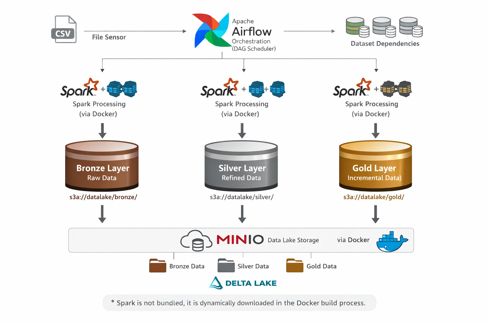

# Projeto de Data Collection& Storage

- Kevyn Zarpellon - RA: 10749524 
- Matheus Eman - RA: 1049523

===========================================================

## Visão Geral
Este projeto tem como objetivo a construção de um pipeline de dados utilizando arquitetura Medallion (Bronze → Silver → Gold), com processamento distribuído via Apache Spark, orquestração com Apache Airflow (Astronomer) e armazenamento em MinIO (S3-compatible).

- **Fonte:** https://www.kaggle.com/datasets/psparks/instacart-market-basket-analysis/data/code

- Bronze → dados brutos
- Silver → dados tratados e confiáveis
- Gold → dados analiticos e agrupados

A base de dados utilizada foi o dataset **Instacart Market Basket Analysis**, contendo informações sobre pedidos, produtos e comportamento de compra de usuários.

O foco do projeto é simular um ambiente real de engenharia de dados, explorando estratégias como:

- Ingestão incremental
- Deduplicação
- Upsert (merge)
- Append controlado (anti-join)
- Modelagem de dados por camada

# Estrutura do repositório
```bash
. 
├── .astro/
│   ├── config.yaml 
│   ├── dag_integrity_exceptions.txt 
│   ├── test_dat_integrety_default.py 
│
├── .devcontainer/
│   ├──devcontainer.json  
│ 
├── dags/ 
│   └── *
│
├── input_data/ 
│   └── *.csv
│
├── minio_data/ 
│ 
├── plugins/ 
│ 
├── spark/ 
│   └── *.tgz
│ 
├── spark_jobs/ 
│   └── *.py 
│
├── .dockerignore
├── .env
├── airflow_setting.yaml
├── Dockerfile 
├── docker-compose.override.yml
├── requirements.txt
```

## Arquitetura
<p align="center">
  
</p>

### Camada Bronze
**Objetivo:** Armazenar os dados como chegam da origem, garantindo a rastreabilidade

| Estratégia              | Motivo                                  |
|------------------------|------------------------------------------|
| Parquet                | Melhor performance que CSV              |
| Sem deduplicação       | Preservar dado original                 |
| Coluna dt_carga        | Controle de ingestão                    |
| Schema próximo ao raw  | Facilidade de debug                     |
| Particionamento futuro | Melhorar performance de leitura         |

### Camada Silver
**Objetivo:** Transformar os dados para uso analítico com qualidade e consistência.
- **aisles**
    - Padronização de colunas
    - Merge (upsert)
    - Baixo volume → custo aceitável
- **products**
    - Chave primária: product_id
    - Merge para atualização de atributos
    - Deduplicação
- **orders:**
    - Tratamento de nulos
    - Criação de colunas derivadas:
    - is_first_order
    - nome_dia_semana
    - Escrita inicial com overwrite
- **order_products**
    - Tabela fato (alto volume)
    - Chave composta: (order_id, product_id)
    - Estratégia adotada:
    - flowchart LR: 
        - A[Bronze] --> B[Deduplicação] 
        - B --> C[Anti-Join] 
        - C --> D[Append Delta]
    - **Porque não usar merge?:** custo elevado, shuffle pesado (falha no processamento), merge desnecessário

## Camada Gold
**Objetivo:** Apresentação de informações enriquecidas e analiticas para os times de negócios.

## Estratégias de Carga
- Merge (Upsert): usado em tabelas dimensionais, permite a atualização/insert dos dados → Não escalável para grandes volumes
- Anti-Join + Append: escalável, ideal para tabelas fato, evita conflitos.

## Stack Tecnológica
- Apache Spark 3.5
- Apache Airflow → Astronomer
- MinIO (compativel com s3)
- Delta Lake
- Docker

## Principais Desafios
- Conflitos de dependência (Delta + Hadoop + AWS SDK)
- Erros de memória → Principalmente com tabela fato
- Merge com múltiplos matches → Por isso para cada base, foi usado uma estratégia
- Otimização de shuffle.

## Aprendizados
- Estruturação e Configuração de ambiente de dados
- Formas diferentes de aplicação de carga → merge, append, etc.
- Como funciona um Delta Lake internamente

## Próximos Passos:
- Estruturar camada Gold com mais dados
- Criação de Dashboards
- Z-Order Optimization
- Deploy em ambiente cloud
